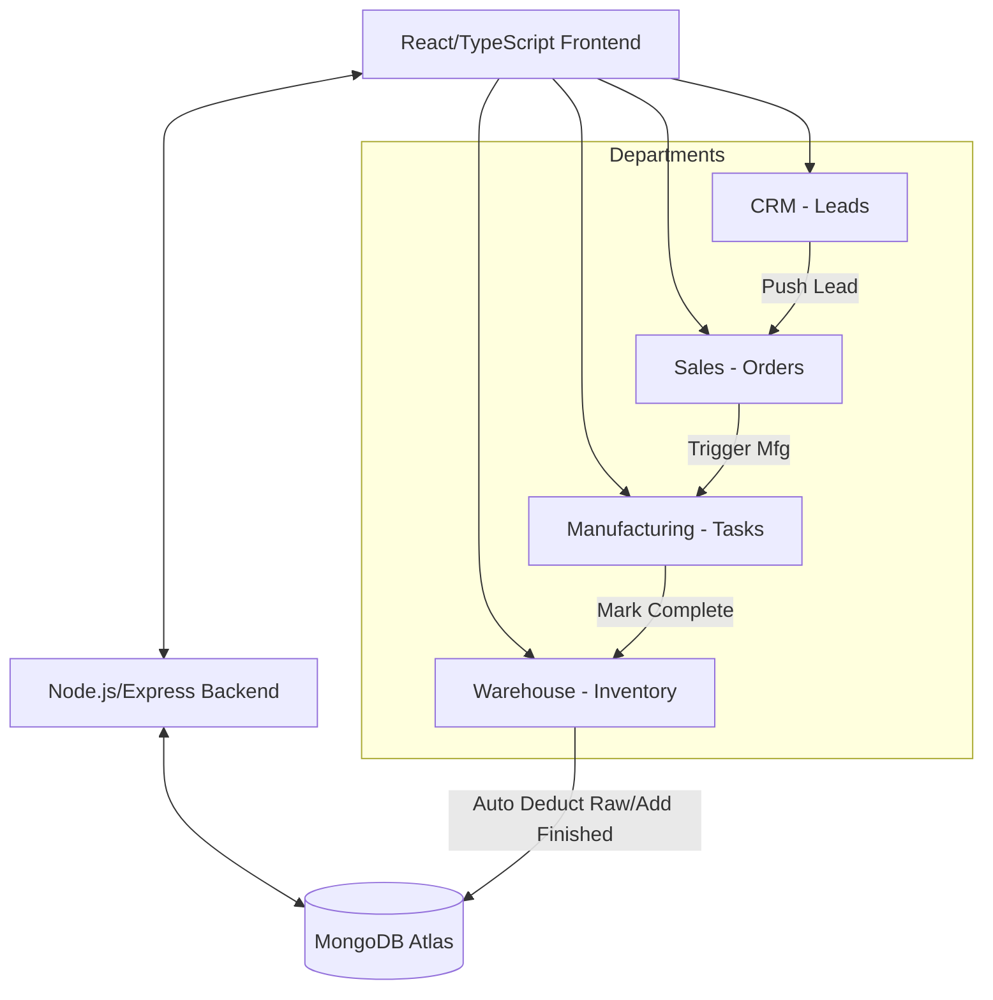

# Meetel Computers & Coated Paper Co. - Demo ERP

A centralized Demo ERP platform built with the MERN stack (MongoDB, Express, React, Node.js). This project implements a "Golden Path" workflow across four departments: CRM, Sales, Manufacturing, and Warehouse.

## System Architecture



## Setup Instructions

### Prerequisites
- Node.js (v18+ recommended)
- MongoDB Atlas cluster (or local MongoDB)

### Environment Variables
1. Navigate to the `server` directory.
2. Copy `.env.example` to `.env`.
3. Add your MongoDB connection string to `MONGODB_URI`.

### Running Locally

**Start the Backend Server:**
```bash
cd server
npm install
npm run dev
```
*(The backend will run on http://localhost:5000)*

**Start the Frontend Application:**
```bash
cd client
npm install
npm run dev
```
*(The frontend will run on http://localhost:5173 by default)*

## API Documentation

### Leads (CRM)
- `GET /api/leads` - Retrieve all leads.
- `POST /api/leads` - Create a new lead.
- `PATCH /api/leads/:id` - Update a lead's status.

### Orders (Sales)
- `GET /api/orders` - Retrieve all orders.
- `POST /api/orders` - Create a new order (changes associated lead status to 'Converted').
- `PATCH /api/orders/:id` - Update an order's status.

### Manufacturing
- `GET /api/manufacturing` - Retrieve all manufacturing tasks.
- `POST /api/manufacturing` - Create a new task (changes associated order status to 'In Manufacturing').
- `PATCH /api/manufacturing/:id` - Update task status. If 'Completed', auto-updates inventory.

### Inventory (Warehouse)
- `GET /api/inventory` - Retrieve current inventory levels.
- `POST /api/inventory/init` - Initialize the demo inventory database.
