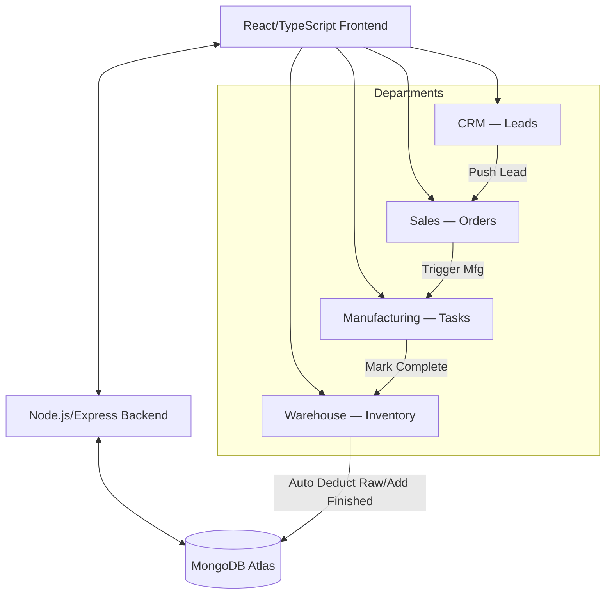

# Meetel Computers & Coated Paper Co. — Demo ERP

A centralized, cloud-ready Demo ERP platform built with the MERN stack (MongoDB, Express, React, Node.js). This project demonstrates a **"Golden Path"** automated workflow across CRM, Sales, Manufacturing, and Warehouse departments.

---

## 🌟 Key Features
- **The "Golden Path" Workflow**: Automated end-to-end business logic from Lead generation to Warehouse stock updates.
- **Auto-Inventory Synchronization**: Real-time deduction of raw materials and addition of finished products upon manufacturing completion.
- **Mobile Responsive Design**: Fully optimized UI for tablets, phones, and desktops.
- **Cloud-Ready Architecture**: Pre-configured for seamless deployment on Vercel and Render.
- **Smart Data Seeding**: Quick-start with pre-populated dummy data for immediate testing.

---

## 📐 System Architecture



---

## ⚙️ Local Setup Instructions

### Prerequisites
- **Node.js**: v18 or higher recommended.
- **MongoDB**: Local MongoDB instance or a MongoDB Atlas cloud cluster.

### 1. Clone the Repository
Open your terminal and run:
```bash
git clone https://github.com/arghya984/ERP-System-Prototype-.git
cd ERP-System-Prototype-
```

### 2. Environment Configuration

**Backend (`/server`):**
1. Navigate to the `server` folder.
2. Create a `.env` file from the example:
   ```bash
   cp .env.example .env
   ```
3. Update `MONGODB_URI` with your connection string.

**Frontend (`/client`):**
1. Navigate to the `client` folder.
2. Create a `.env` file from the example:
   ```bash
   cp .env.example .env
   ```
3. (Optional) Update `VITE_API_URL` if your backend runs on a non-default port.

### 3. Installation & Seeding

**Install & Seed Backend:**
```bash
cd server
npm install
npm run seed
```

**Install Frontend:**
```bash
cd ../client
npm install
```

### 4. Running the Application

**Start Backend (Port 5000):**
```bash
cd server
npm run dev
```

**Start Frontend (Port 5173):**
```bash
cd client
npm run dev
```


## 🔄 The "Golden Path" Workflow
To test the full capability of the ERP:
1.  **CRM**: Create a new lead or use a seeded one. Click **"Push"** to move them to Sales.
2.  **Sales**: Select the lead and create an order. Click **"Trigger Mfg"** to start production.
3.  **Manufacturing**: Find the task and click **"Mark as Completed"**.
4.  **Warehouse**: Observe that Raw Materials were automatically deducted and Finished Products were added to stock!

---

## 🛠️ Tech Stack
- **Frontend**: React 18, TypeScript, Vite, Tailwind CSS, Lucide Icons.
- **Backend**: Node.js, Express.
- **Database**: MongoDB (Mongoose ODM).
