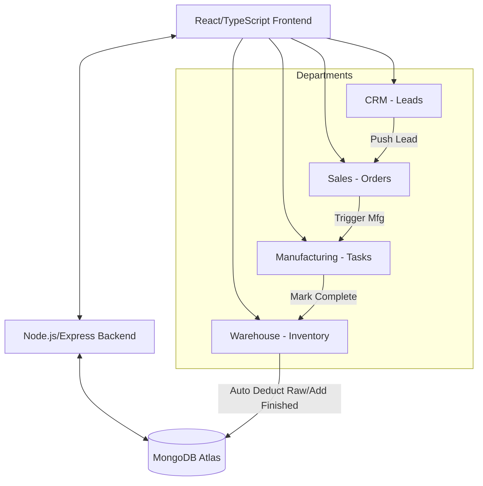

# Meetel Computers & Coated Paper Co. - Demo ERP

A centralized Demo ERP platform built with the MERN stack (MongoDB, Express, React, Node.js). This project implements a "Golden Path" workflow across four departments: CRM, Sales, Manufacturing, and Warehouse.

## System Architecture



## Setup Instructions

### Prerequisites
- Node.js (v18+ recommended)
- MongoDB (Local installation or MongoDB Atlas cluster)

### 1. Environment Configuration

**Backend:**
1. Navigate to the `server` directory.
2. Copy `.env.example` to `.env`.
3. Update `MONGODB_URI` with your connection string (Atlas or Local).

**Frontend (Optional):**
1. Navigate to the `client` directory.
2. Copy `.env.example` to `.env`.
3. (Optional) Update `VITE_API_URL` if your backend runs on a different port.

### 2. Installation & Database Seeding

**Install Backend Dependencies:**
```bash
cd server
npm install
```

**Seed Dummy Data (Recommended):**
Run this command to populate your database with initial leads, orders, and inventory:
```bash
npm run seed
```

**Install Frontend Dependencies:**
```bash
cd client
npm install
```

### 3. Running Locally

**Start the Backend Server:**
```bash
cd server
npm run dev
```
*(The backend will run on http://localhost:5000)*

**Start the Frontend Application:**
```bash
cd client
npm run dev
```
*(The frontend will run on http://localhost:5173)*

## The "Golden Path" Workflow
To test the full capability of the ERP:
1. **CRM**: Create a new lead or use a seeded one. Click **"Push"** to move them to Sales.
2. **Sales**: Select the lead and create an order. Click **"Trigger Mfg"** to start production.
3. **Manufacturing**: Find the task and click **"Mark as Completed"**.
4. **Warehouse**: Observe that Raw Materials were automatically deducted and Finished Products were added to stock!

## API Documentation

### Leads (CRM)
- `GET /api/leads` - Retrieve all leads.
- `POST /api/leads` - Create a new lead.
- `PATCH /api/leads/:id` - Update a lead's status.

### Orders (Sales)
- `GET /api/orders` - Retrieve all orders.
- `POST /api/orders` - Create a new order (changes associated lead status to 'Converted').
- `PATCH /api/orders/:id` - Update an order's status.

### Manufacturing
- `GET /api/manufacturing` - Retrieve all manufacturing tasks.
- `POST /api/manufacturing` - Create a new task (changes associated order status to 'In Manufacturing').
- `PATCH /api/manufacturing/:id` - Update task status. If 'Completed', auto-updates inventory.

### Inventory (Warehouse)
- `GET /api/inventory` - Retrieve current inventory levels.
- `POST /api/inventory/init` - Initialize the demo inventory database.
